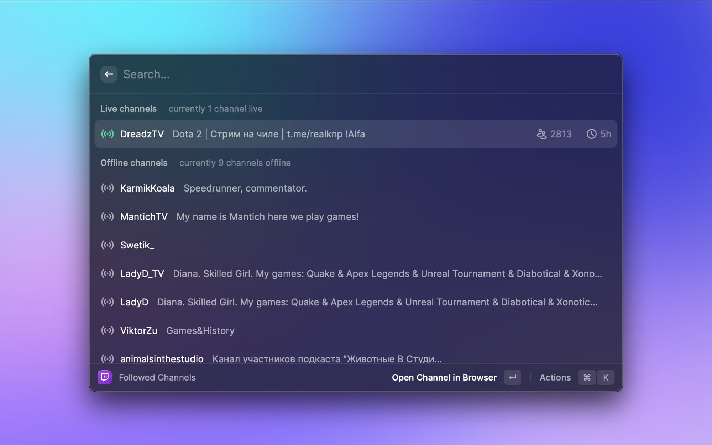

  
  <h1>Twitch Raycast Extension</h1>
  
Raycast extension to search and view information about Twitch users.

  

    
    
  

 

### Features

- display followed channels
- search channels
- view channel videos

 

### Requirements

- [Twitch Client ID](https://dev.twitch.tv/docs/api/get-started#register-an-application) - all Twitch integrations require you to [register your app](https://dev.twitch.tv/docs/authentication/register-app) with Twitch:
  - Log in to the [developer console](https://dev.twitch.tv/console) using your Twitch account.
  - Select the **Applications** tab on the developer console and then click Register **Your Application**.
  - Set **Name** to any name you’d like, it just needs to be unique amongst all Twitch applications.
  - Set **OAuth Redirect URLs** to http://localhost:3000.
  - Choose any **Category** of application that you’d like.
  - Capture your **Client ID**, which you’ll use in the next step to get an OAuth token.

- [OAuth token](https://dev.twitch.tv/docs/authentication/getting-tokens-oauth) - twitch APIs require access tokens to access resources:
  - Create a simple http server (for exmaple: `python -m SimpleHTTPServer 3000` or `python3 -m http.server 3000`).
  - Replace with your **client ID** and follow the link: `https://id.twitch.tv/oauth2/authorize?response_type=token&client_id={{ client_id }}&redirect_uri=http://localhost:3000&scope=user%3Aread%3Afollows`.
  - After authorizing your application by clicking Authorize, the server sends the access token to your redirect URI in the fragment portion of the URI (see the access_token parameter).

*or just use one of the web services - [twitchtokengenerator](https://twitchtokengenerator.com)*

 

### References

- [Twitch Developer Documentation](https://dev.twitch.tv/docs/)
- [Raycast Developer Documentation](https://developers.raycast.com)

 

### Authors
* **[Aleksey Solovyev](https://github.com/alsolovyev)** - [solovyev.a@icloud.com](mailto:solovyev.a@icloud.com)

 

## License
This project is licensed under the [MIT](https://github.com/raycast/extensions/blob/master/LICENSE) License
